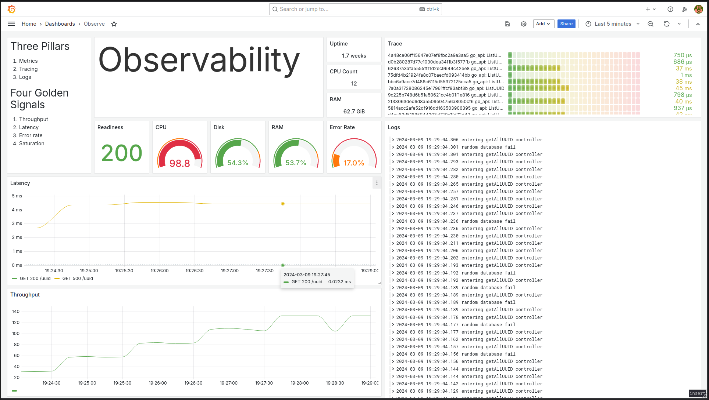

# Introduction

This is a demonstration of OpenTelemetry implemented in two APIs, each in a different language. It displays metrics, traces and logs in a Grafana dashboard.



# How to run

In `docker-compose.yaml`, some container services are mapped to your local port and can cause port conflicts. Make a copy of `env.example`, open `.env` and adjust accordingly.

```sh
cp env.example .env
```

| Service        | Port  |
|----------------|-------|
| Grafana        | 3000  |
| Prometheus     | 9090  |
| Jaeger         | 16686 |
| Go             | 3080  |
| Otel-Collector | 8889  |


Run with (preferably `docker-compose`)

```sh
make up
```

Check all services are up

```sh
docker-compose ps
```

```
          Name                        Command                       State                                                           Ports                                                
-----------------------------------------------------------------------------------------------------------------------------------------------------------------------------------------
go_container               /usr/bin/local/server            Up                      0.0.0.0:3080->3080/tcp,:::3080->3080/tcp                                                             
java_container             java -javaagent:openteleme ...   Up                      8080/tcp                                                                                             
node_exporter              /bin/node_exporter --path. ...   Up                      9100/tcp                                                                                             
otlp_grafana_1             /run.sh                          Up                      0.0.0.0:3000->3000/tcp,:::3000->3000/tcp                                                             
otlp_jaeger-all-in-one_1   /go/bin/all-in-one-linux         Up                      14250/tcp, 14268/tcp, 16686/tcp, 4317/tcp, 4318/tcp, 5775/udp, 5778/tcp, 6831/udp, 6832/udp, 9411/tcp
otlp_loki_1                /usr/bin/loki -config.file ...   Up                      3100/tcp                                                                                             
otlp_otel-collector_1      /otelcol --config=/etc/ote ...   Up                      4317/tcp, 55678/tcp, 55679/tcp                                                                       
otlp_postgres_1            docker-entrypoint.sh postgres    Up (health: starting)   5432/tcp                                                                                             
otlp_prometheus_1          /bin/prometheus --config.f ...   Up                      9090/tcp                                                                                             
otlp_promtail_1            /usr/bin/promtail -config. ...   Up     
```


# Visualise

Go to Grafana dashboard at http://localhost:3000

Credential is admin/admin. Then set your own new password.

Perform a request with `curl`

```sh
curl -v http://localhost:3080/uuid
```
Generate load with you tool of choice. https://k6.io script is included and can be run with

```sh
k6 run load-test.js
```

 

# Blog Post

This repository accompanies the blog post at https://gmhafiz.com/blog